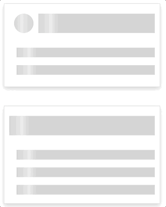

# Skeleton Loader



Displays a skeleton loader that is configurable for a variable number of lines, and an optional round image. This can be modified with pull requests to inlude more scenarios.

> ✨ Bootstrapped with Create Snowpack App (CSA).

## Available Scripts
| Script Name | Description |
| --- |--- |
| start | Starts the development server. Open http://localhost:8080 to view it in the browser. The page will reload if you make edits. You will also see any lint errors in the console. |
| build | Builds the app for production to the `dist/` folder. It correctly bundles the app in production mode and optimizes the build for the best performance. |
| test | For future tests |
| format | Runs prettier formatting |
| update | Runs updating wizard to allow devs to select when to update major / minor / patch version changes. |


## Directives

In case you need to add a directive like `classMap` you should add the extension to the import:

```
import { classMap } from "lit-html/directives/class-map.js";
```
